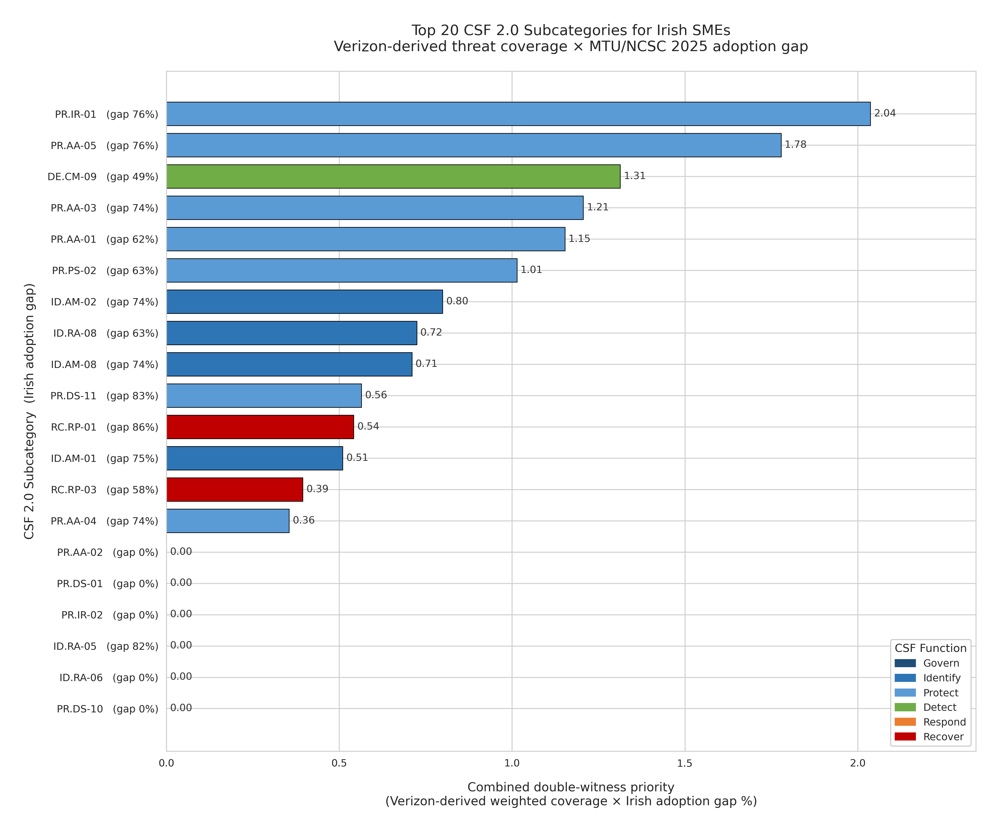
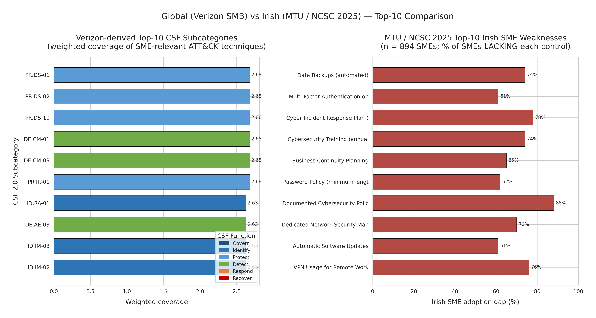
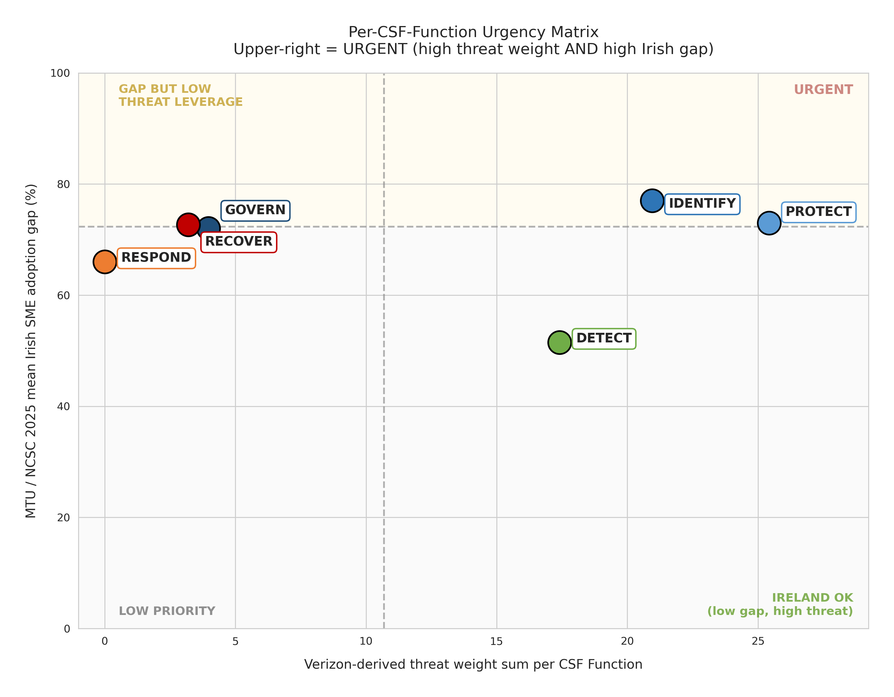
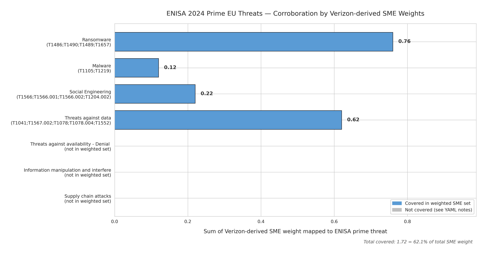
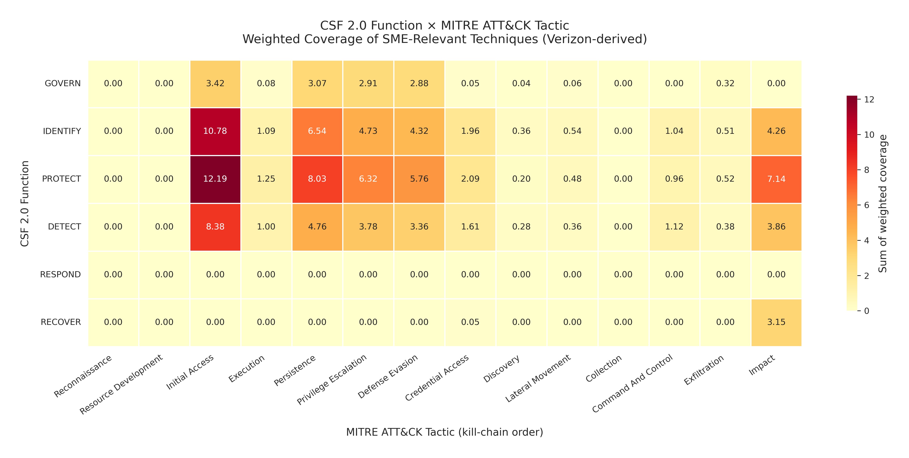

# CSF 2.0 SME Threat-Informed Effectiveness — Findings Report

**Author:** Viraj Ananda Gawde  \  Student ID 24135909  
**Programme:** MSc Cybersecurity, National College of Ireland  
**Generated:** 2026-08-09 17:07  
**Pipeline version:** 0.1.0  

This report is generated automatically by `report.py`. Every table below is derived from the CSV files in this folder; every figure is a PNG in `figures/`. Rerun with `python -m csf_sme_coverage.report`.

---

## Executive Summary

* CSF 2.0 Subcategories analysed: **106** (of which 52 have any Verizon-derived SME threat coverage)
* SME-relevant ATT&CK techniques weighted (Verizon DBIR 2026, n=7,152 SMB breaches): **30**
* Total distributed SME weight across CSF Subcategories: **70.95**
* ATT&CK techniques with zero CSF coverage (residual): **1**
* ENISA 2024 EU prime-threat corroboration: **62.1%** of total SME weight sits under ENISA prime threats

---

## 1. Top-20 Combined Double-Witness Priority

Combines Verizon-derived SME threat coverage with MTU/NCSC 2025 Irish SME adoption gap: high combined score = high threat weight AND large Irish adoption gap.

| Subcat   | Function   |   Weight |   Gap% |   Combined |
|:---------|:-----------|---------:|-------:|-----------:|
| PR.IR-01 | PROTECT    |    2.680 |     76 |      2.037 |
| PR.AA-05 | PROTECT    |    2.340 |     76 |      1.778 |
| DE.CM-09 | DETECT     |    2.680 |     49 |      1.313 |
| PR.AA-03 | PROTECT    |    1.630 |     74 |      1.206 |
| PR.AA-01 | PROTECT    |    1.860 |     62 |      1.153 |
| PR.PS-02 | PROTECT    |    1.610 |     63 |      1.014 |
| ID.AM-02 | IDENTIFY   |    1.080 |     74 |      0.799 |
| ID.RA-08 | IDENTIFY   |    1.150 |     63 |      0.725 |
| ID.AM-08 | IDENTIFY   |    0.960 |     74 |      0.710 |
| PR.DS-11 | PROTECT    |    0.680 |     83 |      0.564 |
| RC.RP-01 | RECOVER    |    0.630 |     86 |      0.542 |
| ID.AM-01 | IDENTIFY   |    0.680 |     75 |      0.510 |
| RC.RP-03 | RECOVER    |    0.680 |     58 |      0.394 |
| PR.AA-04 | PROTECT    |    0.480 |     74 |      0.355 |
| PR.AA-02 | PROTECT    |    0.480 |      0 |      0.000 |
| PR.DS-01 | PROTECT    |    2.680 |      0 |      0.000 |
| PR.IR-02 | PROTECT    |    0.630 |      0 |      0.000 |
| ID.RA-05 | IDENTIFY   |    0.000 |     82 |      0.000 |
| ID.RA-06 | IDENTIFY   |    0.000 |      0 |      0.000 |
| PR.DS-10 | PROTECT    |    2.680 |      0 |      0.000 |

### Figure 4.1 — Top-20 Priority

*CSF 2.0 Subcategories ranked by combined double-witness priority. Colour indicates CSF Function; label shows Irish adoption gap.*

---

## 2. Global (Verizon SMB) vs Irish (MTU/NCSC 2025) Comparison

### 2.1 Verizon-based Top-10 by weighted coverage

| Subcat   | Function   |   Weight |   Raw # |
|:---------|:-----------|---------:|--------:|
| PR.DS-01 | PROTECT    |    2.680 |      28 |
| PR.DS-02 | PROTECT    |    2.680 |      28 |
| PR.DS-10 | PROTECT    |    2.680 |      28 |
| DE.CM-01 | DETECT     |    2.680 |      28 |
| DE.CM-09 | DETECT     |    2.680 |      28 |
| PR.IR-01 | PROTECT    |    2.680 |      28 |
| ID.RA-01 | IDENTIFY   |    2.630 |      27 |
| DE.AE-03 | DETECT     |    2.630 |      27 |
| ID.IM-03 | IDENTIFY   |    2.630 |      27 |
| ID.IM-02 | IDENTIFY   |    2.630 |      27 |

### 2.2 MTU/NCSC 2025 Top-10 Irish SME Adoption Gaps

|   # | Weakness                                              |   Gap% | CSF Subcategories          |
|----:|:------------------------------------------------------|-------:|:---------------------------|
|   1 | Data Backups (automated)                              |     74 | PR.DS-11                   |
|   2 | Multi-Factor Authentication on business-critical apps |     61 | PR.AA-03;PR.AA-04          |
|   3 | Cyber Incident Response Plan (documented and tested)  |     78 | RS.MA-01;RS.MA-02;GV.PO-01 |
|   4 | Cybersecurity Training (annual)                       |     74 | PR.AT-01;PR.AT-02;GV.RR-04 |
|   5 | Business Continuity Planning                          |     65 | RC.RP-01;GV.PO-02          |
|   6 | Password Policy (minimum length enforced)             |     62 | PR.AA-01;GV.PO-01          |
|   7 | Documented Cybersecurity Policy                       |     88 | GV.PO-01;GV.PO-02          |
|   8 | Dedicated Network Security Management                 |     70 | PR.IR-01;GV.RR-01;GV.RR-02 |
|   9 | Automatic Software Updates                            |     61 | ID.RA-08;PR.PS-02          |
|  10 | VPN Usage for Remote Work                             |     76 | PR.IR-01;PR.AA-05          |

### Figure 4.2 — Global vs Irish Top-10

*Side-by-side comparison. Left panel: Verizon-derived Top-10 CSF Subcategories by threat coverage. Right panel: Top-10 quantified weaknesses among 894 Irish SMEs.*

---

## 3. Per-CSF-Function Urgency Matrix

Urgency verdict combines Verizon weight sum with MTU/NCSC 2025 mean Irish gap.

| Function   |   Verizon Weight |   Irish Avg Gap% |   Irish Max Gap% | Verdict                     |
|:-----------|-----------------:|-----------------:|-----------------:|:----------------------------|
| PROTECT    |           25.420 |           73.000 |               76 | URGENT                      |
| IDENTIFY   |           20.950 |           77.000 |               82 | URGENT                      |
| DETECT     |           17.410 |           51.500 |               67 | IRELAND OK                  |
| GOVERN     |            3.970 |           72.000 |               86 | LOW PRIORITY                |
| RECOVER    |            3.200 |           72.700 |               83 | GAP BUT LOW THREAT LEVERAGE |
| RESPOND    |            0.000 |           66.000 |               67 | LOW PRIORITY                |

### Figure 4.3 — Function Urgency Quadrant

*Each CSF Function positioned on (Verizon threat weight, Irish adoption gap) axes. Upper-right quadrant = URGENT. GOVERN and RESPOND appear as LOW PRIORITY under threat-informed coverage despite large Irish gaps - see Discussion (Chapter 5) for the methodological implication.*

---

## 4. NCSC Ireland Guidance Alignment

NCSC Ireland's six prescriptive core measures, cross-referenced with the Verizon-derived weighted coverage of the CSF Subcategories that each measure operationalises.

|   # | NCSC IE Measure                           | CSF Subcategories                   |   Verizon Weight |
|----:|:------------------------------------------|:------------------------------------|-----------------:|
|   1 | Identify what matters most                | ID.AM-01;ID.AM-02;ID.AM-05;ID.RA-01 |            4.390 |
|   2 | Keep devices and software up-to-date      | ID.RA-08;PR.PS-02                   |            2.760 |
|   3 | Implement basic protections               | PR.PS-01;PR.PS-05;DE.CM-09;PR.AT-01 |            5.270 |
|   4 | Turn on Multi-Factor Authentication (MFA) | PR.AA-03;PR.AA-04                   |            2.110 |
|   5 | Back-up your information                  | PR.DS-11;RC.RP-01                   |            1.310 |
|   6 | Create strong complex passwords           | PR.AA-01;PR.AA-02                   |            2.340 |

---

## 5. ENISA 2024 European-Lens Corroboration

Four of the seven ENISA 2024 prime EU threats are directly covered by our Verizon-derived weighted technique set, together accounting for **62.1%** of the total distributed SME weight.

|   # | ENISA Prime Threat                               | In Set   |   Weight | Techniques                            |
|----:|:-------------------------------------------------|:---------|---------:|:--------------------------------------|
|   1 | Ransomware                                       | YES      |    0.760 | T1486;T1490;T1489;T1657               |
|   2 | Malware                                          | YES      |    0.120 | T1105;T1219                           |
|   3 | Social Engineering                               | YES      |    0.220 | T1566;T1566.001;T1566.002;T1204.002   |
|   4 | Threats against data                             | YES      |    0.620 | T1041;T1567.002;T1078;T1078.004;T1552 |
|   5 | Threats against availability - Denial of Service | NO       |    0.000 | nan                                   |
|   6 | Information manipulation and interference        | NO       |    0.000 | nan                                   |
|   7 | Supply chain attacks                             | NO       |    0.000 | nan                                   |

### Figure 4.4 — ENISA Corroboration

*Weight of Verizon-derived SME techniques sitting under each ENISA 2024 prime EU threat category. Blue: covered; grey: not in current SME weight set.*

---

## 6. Residual SME-Relevant Threats

SME-relevant techniques ranked by residual priority (weight ÷ (1 + number of covering Subcategories)). High values = high SMB threat weight AND few CSF controls covering them.

| ATT&CK ID   | Name                                       |   Weight |   #Covers |   Residual |
|:------------|:-------------------------------------------|---------:|----------:|-----------:|
| T1083       | File and Directory Discovery               |    0.040 |         0 |      0.040 |
| T1657       | Financial Theft                            |    0.050 |         1 |      0.025 |
| T1486       | Data Encrypted for Impact (Ransomware)     |    0.480 |        26 |      0.018 |
| T1078       | Valid Accounts (use of stolen credentials) |    0.380 |        34 |      0.011 |
| T1190       | Exploit Public-Facing Application          |    0.290 |        32 |      0.009 |
| T1133       | External Remote Services (VPN, RDP)        |    0.160 |        25 |      0.006 |
| T1490       | Inhibit System Recovery                    |    0.150 |        28 |      0.005 |
| T1567.002   | Exfiltration to Cloud Storage              |    0.050 |         9 |      0.005 |
| T1566       | Phishing                                   |    0.090 |        23 |      0.004 |
| T1219       | Remote Access Software (RMM abuse)         |    0.080 |        21 |      0.004 |

---

## 7. CSF Function × ATT&CK Tactic Coverage Heatmap

### Figure 4.5 — Function × Tactic Heatmap

*Sum of weighted SME coverage across the six CSF Functions and the fourteen ATT&CK Enterprise Tactics (kill-chain order). Darker cells = higher aggregate weighted coverage.*

---

## Data Provenance

| Layer | Source | Sample / Version |
|---|---|---|
| Framework backbone | NIST CSF 2.0 (CSWP 29) | 106 active Subcategories |
| Bridge leg 1 | NIST CSF v2.0 → SP 800-53 Rev 5 Crosswalk (OLIR #186, draft) | 740 mapping rows |
| Bridge leg 2 | Center for Threat-Informed Defense 800-53 → ATT&CK v16.1 | 5,264 mapping rows |
| Threat catalogue | MITRE ATT&CK Enterprise v16.1 | 799 techniques |
| Primary SME weights | Verizon DBIR 2026, Small Business section (pp.97-98) | n = 7,152 SMB breaches |
| Secondary SME weights | Verizon DBIR 2026, System Intrusion pattern (pp.40-41) | n = 12,006 breaches |
| Irish empirical context | MTU + NCSC (2025) State of the Sector | n = 894 Irish SMEs |
| Irish regulatory anchor | NCSC Ireland (2025) SME Cyber Security Guidance | 6 core measures |
| European corroboration | ENISA (2024) Threat Landscape | 7 prime EU threats |

All data sources are version-pinned in `data/raw/`. Pipeline reproducible via `make all` or `python -m csf_sme_coverage.cli`.
